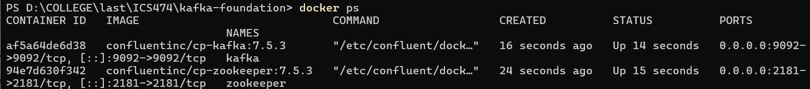

# Project setup
## (Kafka + Zookeeper)
```
docker compose up -d
docker ps
```
## Create Kafka topic

PowerShell (one line):
```
docker exec -it kafka kafka-topics --create --topic iot_sensors --bootstrap-server localhost:9092 --partitions 1 --replication-factor 1
```
## Run consumer (verify messages)
```
docker exec -it kafka kafka-console-consumer --bootstrap-server localhost:9092 --topic iot_sensors
```
## Run IoT producer (Python)
```
python -m venv .venv
.\.venv\Scripts\Activate.ps1
pip install kafka-python
python .\producer\sensor_producer.py
```
# Explanations section

## Why Kafka is used 
Kafka is a message broker that enables reliable, scalable streaming ingestion and decouples producers from consumers.

## What a topic is
A topic is a named stream/channel where producers publish messages and consumers subscribe to read them.

## Role of Zookeeper
Zookeeper coordinates Kafka brokers and manages cluster metadata/leader election (used in this setup).

## Why Kafka decouples ingestion from processing
Producers send data without knowing who consumes it, allowing Spark and other services to process independently.

## Why streaming is better than direct DB writes
Streaming buffers spikes, reduces DB pressure, supports real-time processing, and improves reliability.

# Verification Screenshots

## Kafka & Zookeeper Running


## Kafka Topic Created


## Kafka Consumer Receiving IoT Data


## Python IoT Producer Sending Data


# Quick handoff info for Spark stage

Bootstrap server: localhost:9092

Topic: iot_sensors

Message format: JSON (sensor_id, temperature, humidity, timestamp)
